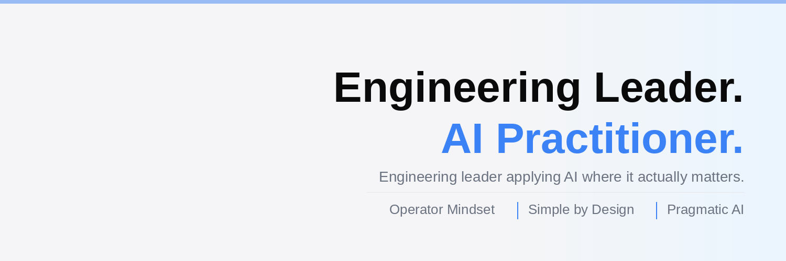

---

### :man_technologist: About Me :

 I am a <technologist />  from Sydney, Australia.
 
 - :telescope: I’m working as a technology leader in a global entertainment company.

- :zap: In my free time, I play guitar and enjoy keeping fit.

- :mailbox:How to reach me: 

---

### :hammer_and_wrench: Languages and Tools :

    &nbsp;
  &nbsp;
  &nbsp;
  &nbsp;
  &nbsp;
  &nbsp;
    &nbsp;
  &nbsp;
  &nbsp;
  

---

### :fire: My Stats :

<!--

-->
