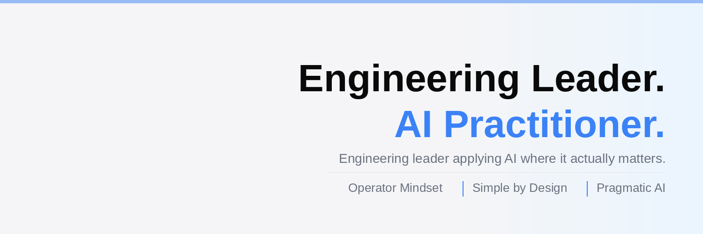

---

### About Me

Engineering Leader. AI Practitioner. Operator.

I lead a globally distributed team of ~175 engineers at FDJ - building high-performance platforms in fintech and trading where uptime and performance is non-negotiable.

AI-native decision making sits at the core of how I operate - keeping people risk, delivery health and compliance exposure in front of me, not behind me.

I build real systems. I share what actually works.

---

### AI Systems I've Built

| System | What it does | Impact |
|---|---|---|
| **Jarvis** | AI orchestrator - the backbone of how I run my organisation | Shifted from instinct-led to signal-led leadership at scale |
| **Chief of Staff AI** | Digests anonymised team notes, surfaces patterns and risk across 175 engineers | Earlier risk detection, better 1:1s, more proactive leadership |
| **Andrew** | Property investment bot - shortlists and evaluates listings against personal investment goals | Replaced hours of manual weekend research with automated recommendations |

---

### AI Stack

Tools I actually use to operate:

---

### Technologies I've Led at Scale

  &nbsp;
  &nbsp;
  &nbsp;
  &nbsp;
  &nbsp;
  &nbsp;
  &nbsp;
  &nbsp;
  &nbsp;
  
  
  
  
  
  

---

### GitHub Stats

